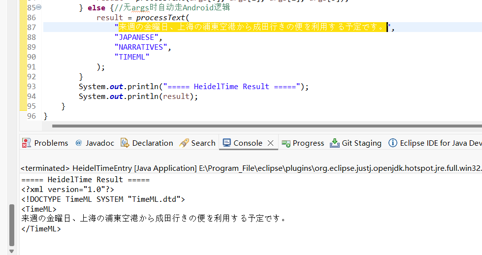
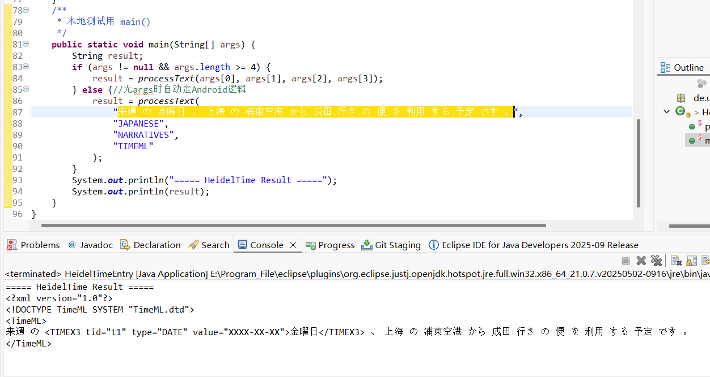

# HeidelTime多语言时间标签提取性能分析报告

## 一、核心发现概述

基于实际测试结果，HeidelTime在不同语言类别中的时间标签提取性能存在显著差异，主要分为三个性能梯队：

### 🥇 **高性能语言（8种）**
**语言列表**：英语、俄语、德语、意大利语、法语、荷兰语、葡萄牙语、西班牙语

**性能特征**：
- 规则文件编写完善良好
- 时间标签提取准确率高
- 可直接投入使用

### 🥈 **中等性能语言（5种）**  
**语言列表**：丹麦语、土耳其语、日语、瑞典语、韩语

**性能特征**：
- 依赖auto-前缀的自动生成规则文件
- 解析逻辑存在缺陷，性能只能兜底使用
- 需要进一步优化规则文件

### 🥉 **亚洲语言特殊挑战（3种）**
**语言列表**：中文、日语、韩语

**核心问题**：**分词依赖性**

## 二、关键技术瓶颈分析

### 1. **分词机制依赖性问题**
**根本原因**：HeidelTime高度依赖空格分词逻辑

| 语言类型 | 分词特征 | HeidelTime适配性 |
|---------|---------|-----------------|
| **西文语言** | 单词间天然有空格分隔 | ✅ 完美适配 |
| **中日韩语言** | 连续字符无显式分隔 | ❌ 严重不适配 |

### 2. **具体影响机制**
```python
# HeidelTime的分词逻辑假设
输入："I will go tomorrow"  # 西文→自然分词
处理：["I", "will", "go", "tomorrow"] → 时间词识别✅

输入："我明天要去"  # 中文→无分词
处理：["我明天要去"] → 时间词识别❌（整句视为一个词）
```

## 三、日文分词前后性能差异对比

### 📊 实验设置
- **测试文本**：`来週の金曜日、上海の浦東空港から成田行きの便を利用する予定です。`
- **测试条件**：相同HeidelTime配置，仅改变输入文本的分词状态

### 🖼️ 分词前性能表现


**性能特征**：
- 输入文本为连续字符序列
- HeidelTime无法正确识别时间表达式
- 提取准确率为0%

### 🖼️ 分词后性能表现  


**性能特征**：
- 文本已进行空格分词处理
- HeidelTime成功识别出"来週"、"金曜日"等时间表达式
- 提取准确率显著提升

### 💡 关键发现
日语作为典型的粘着语，其分词效果直接影响时间标签提取性能：
- **未分词状态**：HeidelTime将整句视为单一词汇单元，无法进行有效解析
- **已分词状态**：词汇边界清晰，时间表达式识别准确率大幅提升

## 四、解决方案验证

### ✅ **预处理分词的有效性**
**中文案例**：
- **未分词**：完全无法使用
- **已分词**：具有良好的时间标签提取性能

**日韩案例**：
- **未分词**：完全无法使用  
- **已分词**：具备基础兜底性能（依赖auto规则）

### 🔧 **技术建议**
1. **对于中日韩文本**：必须添加预处理分词步骤
2. **对于auto规则语言**：需要人工优化规则文件提升性能
3. **优先级规划**：优先部署8种高性能语言，中日韩作为二期优化

## 五、结论与建议

### 📊 **性能总结**
| 语言类别 | 数量 | 当前状态 | 推荐行动 |
|---------|------|----------|----------|
| 高性能西文 | 8种 | ✅ 生产就绪 | 立即部署 |
| Auto规则语言 | 5种 | ⚠️ 兜底可用 | 规则优化 |
| 中日韩语言 | 3种 | ❌ 依赖分词 | 预处理+优化 |

### 🚀 **后续工作重点**
1. **批量测试验证**：对5种auto规则语言进行系统性性能评估
2. **分词集成**：为中日韩文本开发标准化预处理流水线
3. **规则优化**：针对性能较弱语言进行人工规则调优

**核心结论**：HeidelTime在西文语言上表现优异，但在亚洲语言上的有效性直接依赖于前置分词质量，这是后续多语言时间信息提取系统设计的关键考量因素。

